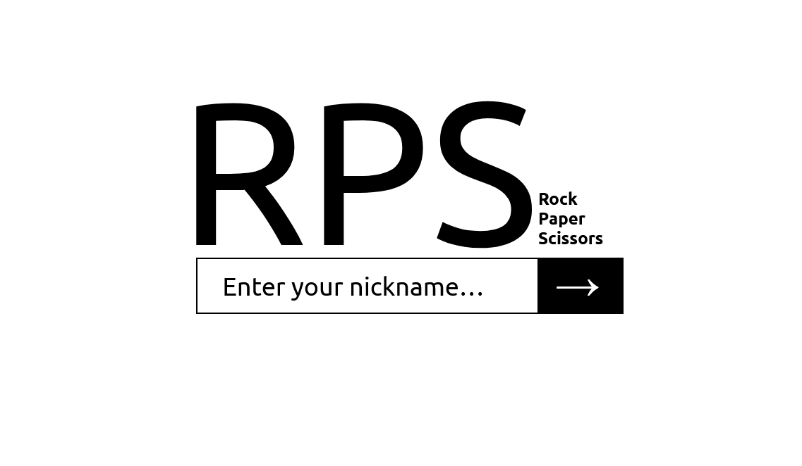
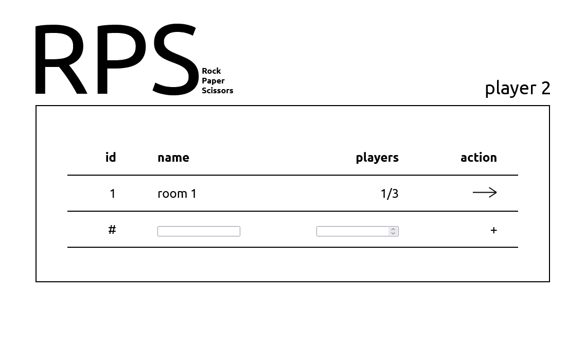
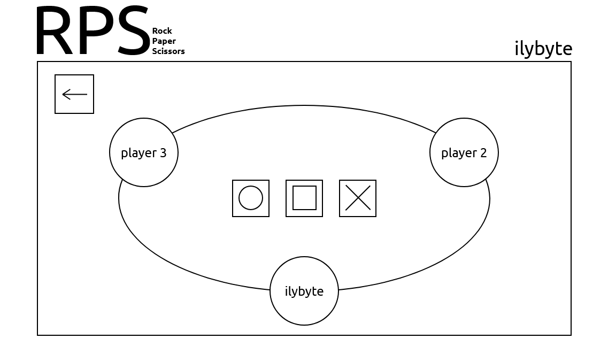

# Rock, Paper, Scissors

<p>
    
    
    
</p>

Web-based multiplayer Rock, Paper, Scissors game.

## Stack:

- Server: NodeJS, Typescript
- Frontend: HTML, Javascript, SASS
- API: long polling

## Instructions:

### Build:

```bash
npm run build
```

### Run:

```bash
npm start
```

### Docker:
```bash
docker-compose up
```
